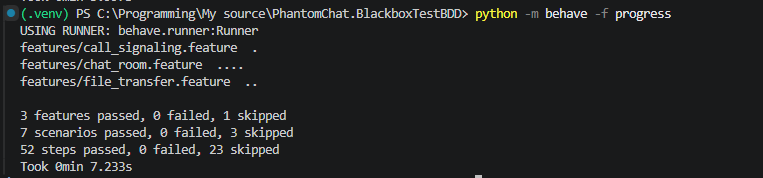

# PhantomChat Black-Box BDD Tests

This repository contains a Python + Behave black-box integration test suite for PhantomChat. The suite interacts with the system only through public interfaces:

- WebSocket at `/room`
- REST upload endpoint at `/upload-document/:filename`
- REST download endpoint at `/download-document/:room/:filename`

The repository also includes a separate async load/stress test CLI for WebSocket-heavy room and chat traffic. That load path is intentionally kept outside Behave so it can simulate higher concurrency without distorting the BDD suite structure.

The scenarios were derived from the current backend and frontend contracts in the sibling repositories, but the tests do not import or call internal application code.

## What is covered

The initial suite focuses on stable, externally visible behavior:

- room creation and join flow over WebSocket
- room-member profile metadata on join responses and join events
- chat message delivery and server-side validation
- explicit leave notifications
- authenticated file upload and download over REST
- file upload broadcast events over WebSocket
- call signaling relay over WebSocket for future WebRTC scenarios

By default, the suite now targets the currently working public deployment behavior. Crypto-specific contract checks are kept in the repository as an optional path and are not part of the default run.

## Project structure

```text
features/
  environment.py
  chat_room.feature
  file_transfer.feature
  call_signaling.feature
  steps/
    connection_steps.py
    http_steps.py
src/phantomchat_blackbox/
  config.py
  http_client.py
  loadtest/
    __main__.py
    config.py
    reporting.py
    runner.py
  protocol.py
  runtime.py
  socket_client.py
  webrtc.py
  world.py
```

## Prerequisites

- Python 3.11+
- run commands from the repository root
- for live execution, a PhantomChat backend that exposes both:
  - an HTTP base URL for file upload and download
  - a WebSocket endpoint compatible with the room protocol used by these scenarios
- optional: a shell command that starts the backend as an external process

## Environment setup

Create a virtual environment and install the suite in editable mode.

PowerShell:

```powershell
Set-Location "C:\Programming\My source\PhantomChat.BlackboxTestBDD"
python -m venv .venv
.\.venv\Scripts\Activate.ps1
python -m pip install --upgrade pip
python -m pip install -e .
```

Bash:

```bash
cd /path/to/PhantomChat.BlackboxTestBDD
python -m venv .venv
source .venv/Scripts/activate
python -m pip install --upgrade pip
python -m pip install -e .
```

## Environment variables

The suite reads configuration only from environment variables. `.env.example` is a reference file; it is not loaded automatically.

Supported variables:

- `PHANTOMCHAT_HTTP_BASE_URL`
- `PHANTOMCHAT_WS_URL`
- `PHANTOMCHAT_VERIFY_TLS`
- `PHANTOMCHAT_REQUEST_TIMEOUT_SECONDS`
- `PHANTOMCHAT_EVENT_TIMEOUT_SECONDS`
- `PHANTOMCHAT_STARTUP_TIMEOUT_SECONDS`
- `PHANTOMCHAT_SERVER_COMMAND`
- `PHANTOMCHAT_SERVER_WORKDIR`

The checked-in `.env.example` targets the current deployed environment:

- `PHANTOMCHAT_HTTP_BASE_URL=https://iping.site`
- `PHANTOMCHAT_WS_URL=wss://iping.site/room`
- `PHANTOMCHAT_VERIFY_TLS=true`

If you do not set any variables yourself, the code defaults now target the current deployed environment at `https://iping.site` and `wss://iping.site/room`.
For a local backend, override `PHANTOMCHAT_HTTP_BASE_URL`, `PHANTOMCHAT_WS_URL`, and `PHANTOMCHAT_VERIFY_TLS` explicitly.

PowerShell example:

```powershell
$Env:PHANTOMCHAT_HTTP_BASE_URL = "https://iping.site"
$Env:PHANTOMCHAT_WS_URL = "wss://iping.site/room"
$Env:PHANTOMCHAT_VERIFY_TLS = "true"
```

Bash example:

```bash
export PHANTOMCHAT_HTTP_BASE_URL="https://iping.site"
export PHANTOMCHAT_WS_URL="wss://iping.site/room"
export PHANTOMCHAT_VERIFY_TLS="true"
```

## Default vs optional coverage

Default runs cover the currently stable public behavior:

- WebSocket connect and room join/create
- chat send and receive behavior as exposed by the deployed service
- leave flow
- file upload and download
- signaling relay

Deferred for now:

- dedicated crypto/public-key contract validation in `features/crypto_contract.feature`

The crypto feature is still maintained in the repository, but it is tagged `@crypto_contract` and excluded by default so it does not block the main suite while that contract is still evolving.

## Local execution

Use these commands from the repository root after activating the virtual environment.

Validate feature parsing and step bindings without requiring a backend:

```bash
python -m behave --dry-run
```

Run the default active suite against the deployed environment:

```powershell
$Env:PHANTOMCHAT_HTTP_BASE_URL = "https://iping.site"
$Env:PHANTOMCHAT_WS_URL = "wss://iping.site/room"
$Env:PHANTOMCHAT_VERIFY_TLS = "true"
python -m behave -f progress
```

Run one active feature file:

```bash
python -m behave features/chat_room.feature -f progress
```

Run a single scenario by line number:

```bash
python -m behave features/chat_room.feature:4
```

Run the full suite:

```bash
python -m behave -f progress
```

Run the deferred crypto contract feature explicitly:

```bash
python -m behave --tags=@crypto_contract features/crypto_contract.feature
```

Run a feature while overriding the target backend through environment variables:

```powershell
$Env:PHANTOMCHAT_HTTP_BASE_URL = "https://your-backend.example"
$Env:PHANTOMCHAT_WS_URL = "wss://your-backend.example/room"
python -m behave features/file_transfer.feature -f progress
```

Notes:

- `--dry-run` is the safest first check and does not require a running backend.
- the default run excludes `@crypto_contract` scenarios.
- live runs require both the HTTP and WebSocket endpoints to match the PhantomChat contract.
- if you only want machine-readable test output, use `--junit --junit-directory test-results`.

## Load and stress testing

The load tool is a separate async CLI that focuses on the public WebSocket contract. It does not depend on Behave state, but it reuses the same public protocol knowledge already encoded in this repository:

- socket command `1` for room join/create
- socket command `2` for chat send
- generated libsodium-style client public keys for join compatibility
- unique room names and user identities per run

It is intended as a practical server-capacity probe for questions such as:

- can the current deployment handle 10, 25, 50, or 100 concurrent users?
- how many users connect and join successfully?
- how many chat messages are acknowledged and delivered?
- when do timeout, join, or disconnect failures start to appear?

### Run the load tool

You can run the tool either through the console script or as a module.

PowerShell:

```powershell
$Env:PHANTOMCHAT_WS_URL = "wss://iping.site/room"
$Env:PHANTOMCHAT_VERIFY_TLS = "true"
phantomchat-loadtest --users 10 --rooms 2 --messages-per-user 3 --message-rate 1 --ramp-up-seconds 2
```

Equivalent module form:

```powershell
python -m phantomchat_blackbox.loadtest --users 10 --rooms 2 --messages-per-user 3 --message-rate 1 --ramp-up-seconds 2
```

### Practical example commands

Start conservatively and ramp up:

```powershell
python -m phantomchat_blackbox.loadtest --users 10 --rooms 2 --messages-per-user 3 --message-rate 1 --ramp-up-seconds 2
python -m phantomchat_blackbox.loadtest --users 25 --rooms 5 --messages-per-user 3 --message-rate 1 --ramp-up-seconds 5
python -m phantomchat_blackbox.loadtest --users 50 --rooms 10 --messages-per-user 2 --message-rate 1 --ramp-up-seconds 10
```

Short duration-based run instead of fixed per-user message counts:

```powershell
python -m phantomchat_blackbox.loadtest --users 25 --rooms 5 --messages-per-user 0 --duration-seconds 20 --message-rate 1.5 --ramp-up-seconds 5
```

Write a JSON summary to `test-results` for later comparison:

```powershell
python -m phantomchat_blackbox.loadtest --users 25 --rooms 5 --messages-per-user 3 --message-rate 1 --json-output test-results/loadtest-25u.json
```

### Useful options

- `--users`: total concurrent users to simulate
- `--rooms`: number of rooms to distribute them across
- `--messages-per-user`: fixed number of messages each joined user attempts
- `--message-rate`: per-user send rate in messages per second
- `--duration-seconds`: optional duration cap for sender loops
- `--ramp-up-seconds`: spreads connection and join attempts over time
- `--connect-timeout-seconds`: WebSocket handshake timeout
- `--join-timeout-seconds`: join response timeout
- `--send-timeout-seconds`: send response timeout
- `--receive-settle-seconds`: extra wait for late message events after sending completes
- `--json-output`: write a machine-readable report file

### Metrics in the summary

- `Connections`: successful and failed WebSocket handshakes, plus unexpected disconnects
- `Joins`: successful and failed room join/create responses
- `Sends`: chat send attempts, acknowledged sends, and failed sends
- `Receives`: observed `NewMessageReceived` events versus expected event fanout
- `Send ack latency`: time from sending a chat request until its direct server response
- `Delivery latency`: time from send start until a recipient receives the chat event
- `Rooms`: joined-user count per generated room
- `Failures`: top grouped failure reasons for quick diagnosis

### Notes and limitations

- The load tool stays black-box and uses only the public WebSocket interface.
- Delivery latency is measured using unique generated message payloads and recipient events; it is useful for capacity checks, not precision benchmarking.
- The current implementation focuses on join and chat traffic, which is the most useful MVP for server-capacity checks on a weak deployment.
- It does not currently model uploads, downloads, or signaling load.

## Optional backend startup from the test suite

If you prefer the suite to boot the backend process for you, set `PHANTOMCHAT_SERVER_COMMAND`. Set `PHANTOMCHAT_SERVER_WORKDIR` as well when the backend must start from a specific directory.

```powershell
$Env:PHANTOMCHAT_HTTP_BASE_URL = "http://127.0.0.1:8080"
$Env:PHANTOMCHAT_WS_URL = "ws://127.0.0.1:8080/room"
$Env:PHANTOMCHAT_SERVER_COMMAND = ".\\path\\to\\start-backend.cmd"
$Env:PHANTOMCHAT_SERVER_WORKDIR = "C:\path\to\backend"
python -m behave -f progress
```

The test harness waits until the configured WebSocket host and port become reachable before scenarios start.

## CI execution

The repository includes a GitHub Actions workflow at [.github/workflows/bdd.yml](.github/workflows/bdd.yml).

It runs in two stages:

- `validate-suite` always installs the project and runs `python -m behave --dry-run`
- `run-blackbox-tests` runs the live suite only when `PHANTOMCHAT_HTTP_BASE_URL` and `PHANTOMCHAT_WS_URL` are configured in repository variables

That split keeps CI useful even when no shared integration environment is available.

For other CI systems, use the same pattern:

```bash
python -m pip install --upgrade pip
python -m pip install -e .
python -m behave --dry-run
python -m behave --junit --junit-directory test-results
```

## Troubleshooting

- If `python -m behave --dry-run` passes but live runs fail immediately, verify that `PHANTOMCHAT_HTTP_BASE_URL` and `PHANTOMCHAT_WS_URL` point to the same PhantomChat deployment.
- If the WebSocket step fails with a 404 during the handshake, the target server is reachable but `PHANTOMCHAT_WS_URL` is not the correct WebSocket endpoint for that environment.
- If you are testing against HTTPS or WSS with a valid certificate, set `PHANTOMCHAT_VERIFY_TLS=true`.
- The deployed environment currently emits `NewMessageReceived` to the other room member and returns a successful leave response without a stable echoed `request_uuid`. The active scenarios reflect that behavior.

## Notes from repository analysis

The current contract inferred from the application repositories is:

- backend default listen port: `8080`
- WebSocket endpoint: `/room`
- socket commands:
  - `1`: join or create room
  - `2`: send chat message
  - `3`: leave room
  - `4`: relay call signaling
- upload requires headers:
  - `x-room-name`
  - `x-user-uuid`
- join requests include a `public_key` field
- join requests can include `avatar_id` and `display_name`
- join responses currently expose both `room_key` and `server_pub_key`
- join responses expose `members` as member objects with `user_uuid`, `avatar_id`, and `display_name`
- `UserEnteredRoom` events expose `avatar_id` and `display_name`
- the observed deployed join flow is compatible with libsodium box-based handling: a client can send a Curve25519 public key, receive encrypted room key material back, and open it with the matching private key when using the returned `server_pub_key` and the currently observed zero nonce convention
- chat messages are still sent and relayed through the public `message` field as plain text at the protocol level; no public AES message envelope is exposed yet

The suite intentionally validates those behaviors from the wire, not through direct code reuse.

## Deferred crypto coverage

The suite still contains crypto-related black-box checks for future use, including:

- a client can generate a real key pair with PyNaCl and submit the public key during room join
- malformed public-key material is rejected at the protocol boundary
- room join returns encrypted key material in `room_key`
- the join reply exposes `server_pub_key`
- the returned encrypted `room_key` can be opened client-side with the matching private key
- the opened room key is stable for multiple members of the same room
- different rooms open to different room keys

Those checks are opt-in for now because the crypto/public-key contract is still considered subject to change.

What the deferred crypto suite does not currently prove:

- that chat messages are AES-encrypted before they cross the wire
- what the public AES message envelope looks like on the socket
- how a recipient should distinguish encrypted chat content from ordinary plain-text message payloads
- whether file encryption and chat encryption are intended to use the exact same decrypted room key bytes and framing rules

Those properties are not fully observable through the current public API because the message contract still exposes a plain `message` field and does not publish the nonce, algorithm marker, ciphertext field names, or any other AES framing needed for black-box verification.

The suite now also covers the highest-value encrypted transport checks that are possible today without changing the application:

- optional scenarios can encrypt chat content client-side, carry that ciphertext inside the existing `message` field, and verify another room member can decrypt it with the same opened room key
- those chat scenarios prove the backend can relay opaque ciphertext without exposing the plaintext in the observed socket payloads, but they do not claim the current frontend already uses that format in production
- optional scenarios can encrypt file bytes with the opened room key, upload the encrypted bytes, download them again, and verify the downloaded ciphertext opens back to the original content
- those file scenarios mirror the current frontend-compatible nonce-prefixed secretbox blob format that is already observable at the public HTTP boundary

## Future extension for RTCPeerConnection scenarios

The current call scenarios stop at signaling relay, which is the right black-box boundary for the server today. For end-to-end media negotiation later, the project is prepared in two ways:

- the protocol and signaling assertions are isolated from feature steps, so WebRTC-specific flows can be layered in without rewriting the suite
- an optional `webrtc` extra is declared for `aiortc`, allowing future Python-based peer connection harnesses without changing the base test dependencies

The next step for richer call coverage would be to add a dedicated peer connection adapter that:

- creates offers and answers with `aiortc`
- feeds ICE candidates through the existing signaling steps
- asserts connection state transitions and optional media/data-channel exchange

## Future extension for full crypto verification

The suite now includes a PyNaCl-based client harness for the join flow, so the remaining step for full end-to-end crypto verification is the chat payload contract itself. Once the public API exposes an explicit AES message envelope, the suite should extend the optional crypto coverage to:

- encrypt chat payloads with the decrypted room key before sending
- assert the wire format is ciphertext rather than plain text
- decrypt received chat payloads back to the expected message content

Until then, full end-to-end crypto validation should remain optional and limited to the join-time key exchange.


